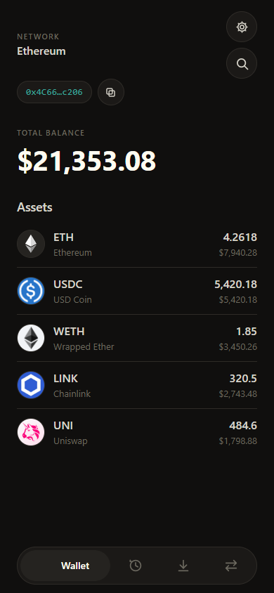
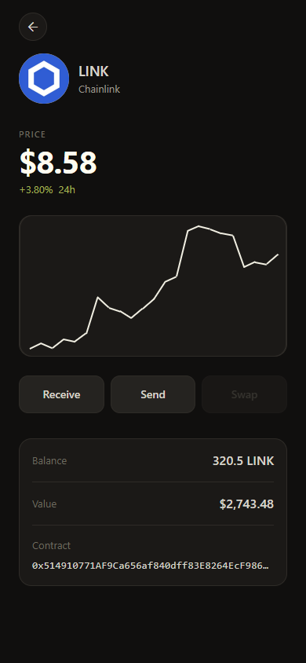
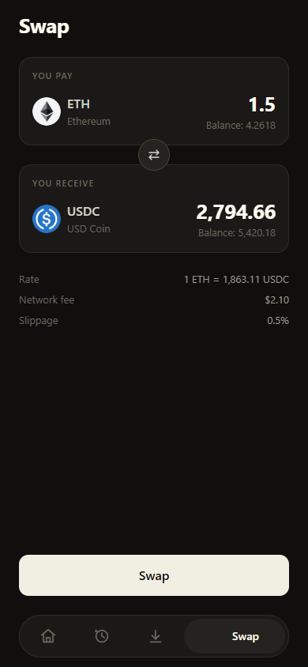
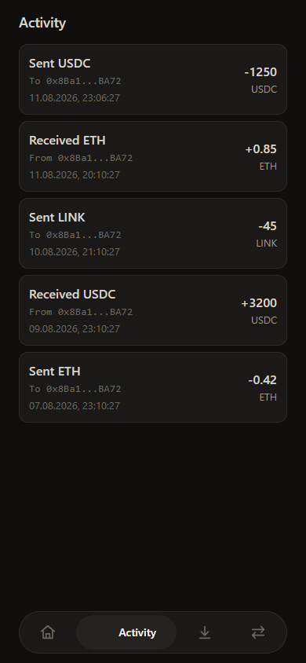

# crypto-wallet

Self-custodial Ethereum wallet. Your keys, your coins — on iOS, Android and web.

| | | | |
| --- | --- | --- | --- |
|  |  |  |  |

<details>
<summary>Run it</summary>

```bash
npm install
echo EXPO_PUBLIC_ALCHEMY_API_KEY=your_key > .env
npm run web
```

</details>
