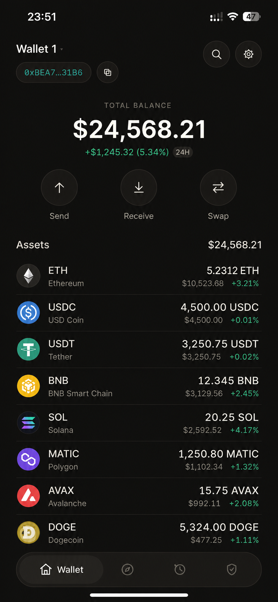
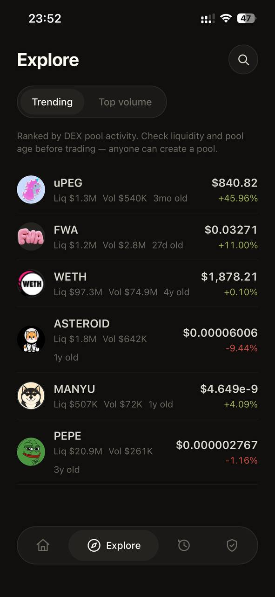
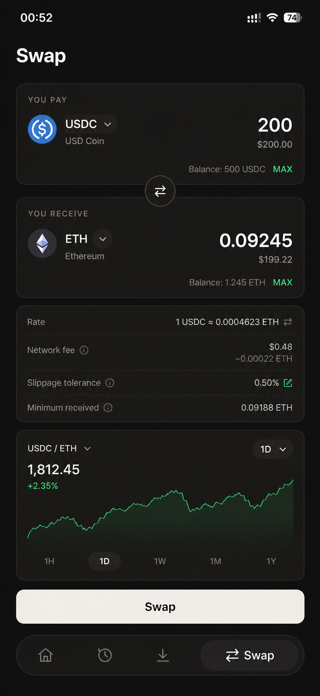
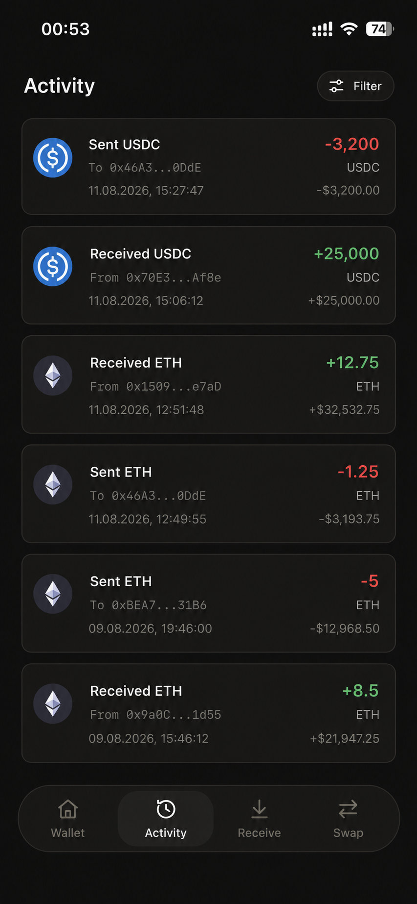

# crypto-wallet

Self-custodial Ethereum wallet. Your keys, your coins — on iOS, Android and web.

Most wallets show you what you are signing. This one is built to tell you what you are risking, before you sign it, and what the trade actually cost you, after it lands.

|                                 |                                   |
| ------------------------------- | --------------------------------- |
|  |   |
|    |  |

## Features

### Wallet

- Create and import self-custodial EVM wallets using a recovery phrase
- Manage multiple wallets and switch between active accounts
- Send native tokens and ERC-20 tokens
- View token balances and portfolio value
- Swap tokens through Uniswap
- Track wallet activity and transaction status
- Reveal the recovery phrase and the private key of the active wallet, behind a second PIN prompt

### Security

- **Encrypted local vault** — recovery phrases are encrypted with per-wallet keys and protected by a device-bound master key and PIN-derived authentication
- PIN protection with scrypt-based key derivation and automatic locking
- **Transaction Firewall** — validates transfers, token approvals and swaps before signing
- Configurable limits for:
  - maximum transaction value
  - first transfer to a new recipient
  - daily outflow
  - token approval exposure
  - swap loss exposure
- **Security briefing at the moment of signing** — every confirmation screen states what was checked, what was not, and why, instead of only speaking up to refuse
- **Permission Graph** — scans ERC-20 and Permit2 permissions and shows which contracts can access wallet assets
- **Asset exposure / blast radius** — estimates how much value is currently exposed through active permissions
- One-tap approval revoke for supported ERC-20 and Permit2 permissions
- Blocks unlimited approvals and unknown spenders
- **Emergency Lockdown** — disables all signing and recovery-phrase reveal on the device; clears itself after 24 hours, or sooner through a PIN, a cooldown, and a second PIN, so a stolen unlocked phone cannot switch it off with one tap
- **Absolute network-fee ceiling** — a transaction whose priority fee or maximum fee is far above any real gas price is refused before signing, so a hostile RPC node cannot make the wallet sign its balance away as a tip
- Strict transaction verification before signing, including transaction-field validation, signer recovery and canonical encoding checks

### Swap Protection

- Exact-amount token approvals instead of unlimited approvals
- Known-router enforcement
- Minimum-output validation
- Swap deadline validation
- Expired and excessively long-lived swap transactions are rejected before signing

### Security limitations (honest threat model)

This is a software wallet with no dedicated secure hardware, so some limits are inherent and stated plainly rather than papered over:

- **The recovery phrase at rest is only as strong as the PIN.** Once someone has the stored, encrypted blobs (trivially on the web build, where they sit in `localStorage`; on a rooted or forensically-imaged phone otherwise), the seed is recoverable by brute-forcing the 6-digit PIN offline through scrypt. The in-app lockout does not apply to an offline attacker. Genuine device binding needs a non-exportable hardware factor (WebAuthn/passkey PRF) — a planned change, not a bounded fix.
- **Emergency Lockdown buys time; it is not proof against a determined local attacker.** Moving the device clock forward, or deleting the local lockdown record on the web build, can end it early. There is no trusted monotonic clock in the browser.
- **USD-denominated firewall limits trust the price feed.** They are fetched over TLS from a fixed provider (not the user's chosen RPC) and are disabled on test networks, but a compromised or man-in-the-middled price source could mis-value a transfer. The manipulated value is always shown on the signing briefing.
- **The data-provider API key is bundled into the client.** On the web build it is visible to anyone; abuse is rate-limit and cost, never key theft of user funds. A backend proxy would remove it from the client.
